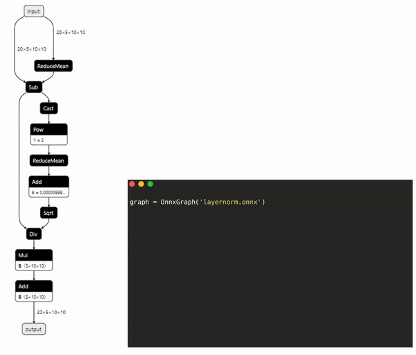

- [1. MagicONNX简介](#1-magiconnx简介)
- [2. 安装](#2-安装)
- [3. 使用方法](#3-使用方法)

# 1. MagicONNX简介

`MagicONNX` 是一个支持方便修改onnx文件的项目，其主要优势在于：
- 有详细的API文档说明

  相对于ONNX官方接口而言，MagicONNX有详细的接口说明和示例

- 可扩展的支持优化方法

  目前已支持的优化方法：
  - **long2int**: int64转int32计算
  - **constfolding**：常量折叠

# 2. 安装

```shell
git clone https://gitee.com/Ronnie_zheng/MagicONNX.git
cd MagicONNX
pip install .
```

# 3. 使用方法

[学习教程](./docs/tutorials.md)

[API说明](./docs/operations.md)



```python
from magiconnx import OnnxGraph
graph = OnnxGraph('layernorm.onnx')

# 原onnx中只有一个input输入，现在增加一个 dummy_input 输入结点
ph = graph.add_placeholder('dummy_input', 'int32', [2, 3, 4])

# 增加一个add节点
add = graph.add_node('dummy_add', 'Add')      # add_node默认单输入单输出，需要手动修改节点输入输出信息

# 设置add节点的输入输出【连边】
init = graph.add_initializer('dummy_init', np.array([[2, 3, 4]]))
add.inputs = ['dummy_input', 'dummy_init']
add.outputs = ['add_out']

# 在add前面插入argmax节点，属性用dict传参
argmax = graph.add_node('dummy_ArgMax',
                      'ArgMax',
                      {'axis': 0, 'keepdims': 1, 'select_last_index': 0})
graph.insert_node('dummy_add', argmax, mode='before')

# 保存修改好的onnx图
graph.save('case2.onnx')
```
