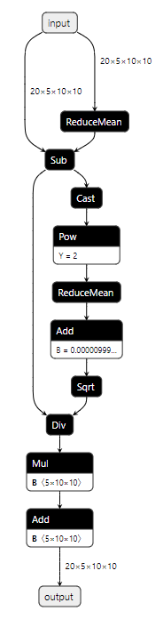

- [OnnxNode说明](#onnxnode说明)
  - [关键概念定义](#关键概念定义)
    - [Placeholder定义](#placeholder定义)
    - [Initializer定义](#initializer定义)
    - [Node定义](#node定义)
  - [方法使用说明](#方法使用说明)
    - [通用方法](#通用方法)
    - [私有方法](#私有方法)
    - [一些遗留事项](#一些遗留事项)

# OnnxNode说明

## 关键概念定义

### Placeholder定义

- 表示**ONNX整网中的输入输出节点**；
- 特有属性包括 **`shape`**, **`dtype`**；
- 在ONNX框架中对应于 [onnx.proto3](https://github.com/onnx/onnx/blob/master/onnx/onnx.proto3) 的 **`ValueInfoProto`**。

### Initializer定义

- 表示**ONNX整网中的常量节点**；
- 特有属性包括 **`value`**；
- 在ONNX框架中对应于 [onnx.proto3](https://github.com/onnx/onnx/blob/master/onnx/onnx.proto3) 的 **`TensorProto`** 和 [ONNX标准库算子](https://github.com/onnx/onnx/blob/master/docs/Operators.md) 的 **`Constant`** 算子；

### Node定义

- 表示**ONNX整网中的计算节点**，可参见[ONNX标准库算子](https://github.com/onnx/onnx/blob/master/docs/Operators.md)；
- 特有方法包括主要是修改输入输出和属性，下面有描述；

## 方法使用说明

### 通用方法

| 属性/方法      |                         释义                         |
| -------------- | :--------------------------------------------------: |
| `node.node`    |         只读属性，返回ONNX下的proto类型对象          |
| `node.op_type` | 可读写属性，节点类型(`Placeholder/Initializer/Node`) |
| `node.name`    |                 可读写属性，节点名称                 |
| `node.inputs`  |                 可读写属性，节点输入                 |
| `node.outputs` |                 可读写属性，节点输出                 |
| `node.prev()`  |             方法，返回node的前驱结点列表             |
| `node.next()`  |             方法，返回node的后继结点列表             |

- 示例代码

  ```python
  def test_common(node):
      print(f'type(node): {type(node)}\n',
            f'node.node: {node.node}\n',
            f'node.op_type: {node.op_type}\n',
            f'node.name: {node.name}\n',
            f'node.inputs: {node.inputs}\n',
            f'node.outputs: {node.outputs}\n',
            f'node.prev(): {node.prev()}\n',
            f'node.next(): {node.next()}\n')
  ```

- 关于 `inputs VS prev()` 和 `outputs VS next()` 的解释

  <center>
  
  

  layernorm 结构
  </center>

  使用 `node.inputs` 或者 `node.outputs` 是为了得到当前node的输入输出；比如 `Sub` 有两个输入一个输出（与Sub定义对应，任何模型中都是一样的）

  使用 `node.prev()` 或者 `node.next()` 是为了得到当前node的前驱节点和后继节点；比如 `Sub` 有两个后继节点 `Cast` 和 `Div`（不同模型或者同一模型不同节点都可能存在差异）

### 私有方法

<table border="1">
<caption>私有属性与方法</caption>
<tr>
  <th rowspan="2">PlaceHolder</th>
  <td>ph.dtype</td>
  <td>可读写属性，PlaceHolder 节点数据类型</td>
</tr>
<tr>
  <td>ph.shape</td>
  <td>可读写属性，PlaceHolder 节点维度信息</td>
</tr>
<tr>
  <th rowspan="1">Initializer</th>
  <td>init.value</td>
  <td>可读写属性，借助numpy获取/修改常量节点具体数值</td>
</tr>
<tr>
  <th rowspan="2">Node</th>
  <td>node.attrs</td>
  <td>只读属性，获取 Node 节点所有属性键值对</td>
</tr>
<tr>
  <td>node['attr_1'] <br></br> node['attr_1'] = attr_x</td>
  <td>获取/修改 Node 属性</td>
</tr>
</table>

- 示例代码

```python
def test_ph(ph):
    print(f'ph.dtype: {ph.dtype}\n',
          f'ph.shape: {ph.shape}\n',
          f'ph: {ph}')


def test_init(init):
    print(f'init.value: {init.value}\n',
          f'init: {init}')
```

### 一些遗留事项

- 直接使用 `BaseNode.create_node(node)` 会导致部分功能bug，如 `prev()/next()` 接口会报错或者不更新，主要是因为node没有更新 Assistant 类。
